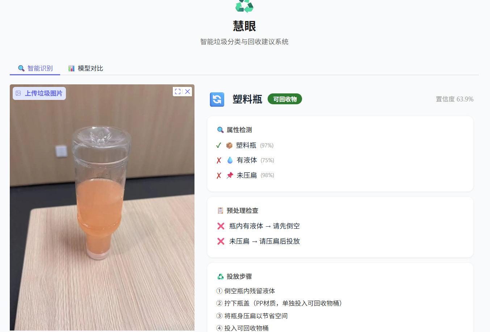
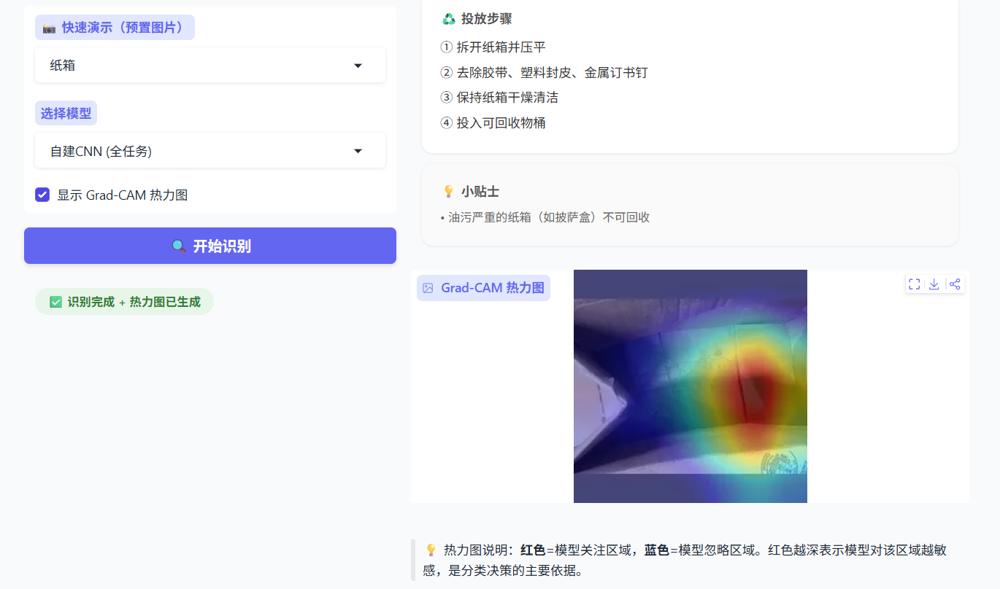

# 慧眼 — 智能垃圾分类与回收建议系统

基于 PyTorch + ResNet18 的垃圾分类系统，支持多任务属性检测、Grad-CAM 可视化、YOLOv8 对比实验和 Gradio Web 交互界面。

## 文件夹说明

```
├── app.py                  # Gradio Web 界面（含 Grad-CAM、规则引擎、模型切换）
├── train.py                # 主训练脚本（支持单任务/多任务、CNN/ResNet18 骨干）
├── config.py               # 全局路径、类别名、回收分类映射、归一化参数
├── setup_data.py           # 数据准备：拆分 train/val/test + 瓶子照片整合
├── gen_comparison.py       # 生成 CNN vs YOLOv8 对比图
├── requirements.txt
├── .gitignore
│
├── models/
│   ├── cnn_model.py        # ConvBlock + MultiTaskCNN（核心模型） + SingleTaskCNN
│   └── yolo_train.py       # YOLOv8n-cls 分类训练（对比实验用）
│
├── utils/
│   ├── dataset.py          # GarbageDataset 数据加载 + 5种数据增强 + MixUp + collate
│   ├── visualize.py        # 训练曲线、混淆矩阵、对比柱状图、模型对比图
│   ├── label_tool.py       # 交互式/批量数据标注 + CSV 合并
│   └── prepare_liquid_data.py # 辅助：液体标注数据处理
│
├── experiments/
│   ├── run_all.py          # 一键运行所有消融实验并汇总结果
│   ├── exp_kernel.py       # 实验1：卷积核大小对比 (kernel_size = 3/5/7)
│   ├── exp_dropout.py      # 实验2：Dropout 比例对比 (dropout = 0.0/0.3/0.5/0.7)
│   └── exp_augment.py      # 实验3：数据增强有无对比
│
├── data/
│   ├── Garbage_Dataset/    # 主数据集（train/val/test 各含10类，8:1:1拆分）
│   ├── *_annotation.csv    # 4个属性标注文件
│   └── 照片/               # 自拍瓶子照片（按液体量分为 多/中/少/空）
│
├── checkpoints/            # 训练好的模型权重（主模型 137MB × 2）
├── results/                # 训练曲线、混淆矩阵、消融实验对比图、模型对比图
├── latex_images/           # 论文插图（8张）
├── runs/classify/          # YOLOv8 训练结果和 weights
│
├── resnet18-f37072fd.pth   # ResNet18 ImageNet 预训练权重（44.7MB）
├── yolov8n-cls.pt          # YOLOv8n-cls 预训练权重（5.3MB）
│
├── experiment_report.tex   # 实验报告 LaTeX 源码
├── experiment_report.pdf   # 实验报告 PDF
├── web页面1.png            # Web 界面截图（识别结果）
├── web页面2.png            # Web 界面截图（模型对比）
└── README.md
```

## 运行步骤

以下命令均需在项目根目录下执行。

### 第 1 步：安装依赖

```bash
pip install torch torchvision ultralytics gradio opencv-python matplotlib seaborn pandas tqdm psutil
```

### 第 2 步：准备数据

将原始数据集拆分为 train/val/test，同时整合自拍瓶子照片并生成 liquid 标注：

```bash
python setup_data.py
```

完成后检查 `data/Garbage_Dataset/` 下应有 `train/`、`val/`、`test/` 三个子目录，各含 10 个类别文件夹。

### 第 3 步：训练多任务模型

```bash
python train.py --mode multi --epochs 50 --batch_size 32
```

- 自动使用 ResNet18 骨干 + ImageNet 预训练权重
- 同时训练分类头（10 类）和 4 个属性检测头
- 每 epoch 输出 TrainLoss / ValLoss / TrainAcc / ValAcc
- 自动保存最佳模型到 `checkpoints/`
- 训练结束后自动生成 Loss/Accuracy 曲线和混淆矩阵到 `results/`

GPU 加速（需 CUDA）：

```bash
python train.py --mode multi --epochs 50 --batch_size 128 --device cuda
```

### 第 4 步：启动 Web 界面

```bash
python app.py                # 本地访问 http://127.0.0.1:7860
python app.py --share        # 生成公网链接，其他人可通过链接访问
```

Web 界面功能：

- 上传图片 / 手机拍照 / 剪贴板粘贴
- 选择模型（自建CNN 或 YOLOv8）
- 显示分类结果、置信度、属性检测状态
- 预处理检查清单 + 投放步骤 + 环保小贴士
- 勾选"显示 Grad-CAM 热力图"查看模型关注区域
- 模型对比页表格

### 第 5 步：训练 YOLOv8 对比模型

```bash
# 删除旧结果（如果之前跑过）
rm -r checkpoints/yolov8_cls runs/classify/val*

# 训练
python models/yolo_train.py --epochs 30
```

### 第 6 步：运行参数对比实验

```bash
# 一键运行三个实验（约 2~3 小时，CNN 骨干无预训练、各10 epoch）
python experiments/run_all.py

# 或分别运行
python experiments/exp_kernel.py     # 卷积核 3/5/7 对比
python experiments/exp_dropout.py    # Dropout 0.0/0.3/0.5/0.7 对比
python experiments/exp_augment.py    # 数据增强有/无对比
```

每个实验训练完成后自动读取 checkpoint 中的 best_val_acc 并生成对比柱状图。

### 第 7 步：生成 CNN vs YOLO 对比图

```bash
python gen_comparison.py
```

产出 `results/model_comparison.png`（准确率 + 参数量双图对比）。

## 标注格式

```csv
filename,liquid          # 液体: 0=空瓶, 1=有液体
filename,flattened       # 压扁: 0=未压扁, 1=已压扁
filename,spread          # 展平: 0=未展平, 1=已展平
filename,is_bottle       # 瓶子: 0=非瓶, 1=瓶子
```

CSV 中 `filename` 为相对于 `data/Garbage_Dataset/` 的路径（如 `train/plastic/bottle_中_中 (10).jpg`）。新增标注可使用 `python utils/label_tool.py interactive` 逐张标注。

## 模型架构

```
ResNet18 (ImageNet预训练) → 512维特征 → Dropout(0.5) → FC(512) → ReLU
                                                                    │
            ┌────────────────────────────────────────────────────────┤
            ▼                                                        ▼
   分类头: Linear(512→10)                              属性头 (×4): Linear(512→2)
   → 10类垃圾分类                                       → is_bottle / liquid / flatten / spread
```

## 界面展示

| 识别结果页 | 模型对比页 |
|:---:|:---:|
|  |  |

## 实验结果

| 指标 | 数值 |
|------|------|
| 测试集分类准确率 | **95.50%** |
| 最佳验证准确率 | 95.65% |
| liquid 检测 | 95.00% |
| spread 检测 | 93.75% |
| flatten 检测 | 85.94% |
| is_bottle 检测 | 72.22% |
| 训练耗时 | ~28 小时 (CPU) |

### 各类别准确率

| 类别 | 准确率 | 类别 | 准确率 |
|------|--------|------|--------|
| battery | 100.00% | glass | 96.00% |
| shoes | 99.32% | paper | 95.56% |
| clothes | 98.95% | cardboard | 94.83% |
| metal | 98.26% | trash | 94.59% |
| biological | 94.38% | plastic | 89.53% |

### 消融实验

| 实验 | 最优值 |
|------|--------|
| 卷积核大小 | kernel=3（57.19% vs 52.58% / 53.91%） |
| Dropout 比例 | dropout=0.5（短训 57.19%，长训防过拟合） |

### 模型对比

| 模型 | 分类准确率 | 属性检测 | Grad-CAM | 回收建议 |
|------|-----------|---------|----------|---------|
| 自建CNN (ResNet18) | 95.50% | ✓ | ✓ | ✓ |
| YOLOv8n-cls | 99.1% | ✗ | ✗ | ✗ |
